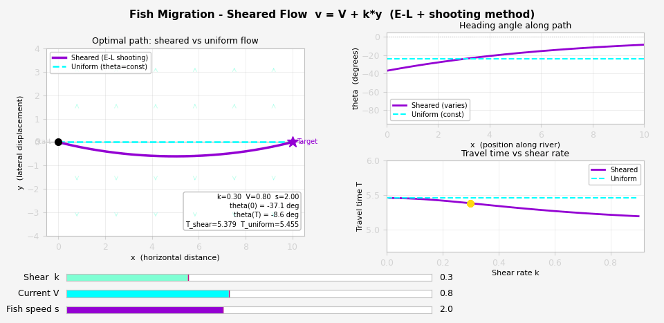
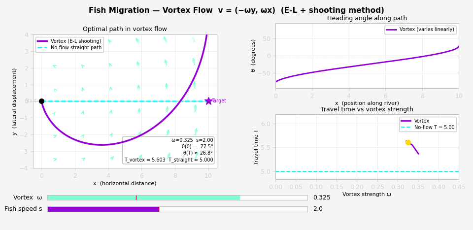

# path-optimisation-shear-flow-with-vortex-flow-extension
Undergraduate dissertation project (MT4599, University of St Andrews).

An interactive simulation of the classic navigation/path optimisation problem:
given a swimmer (or fish) with fixed speed moving through a flowing river,
what heading angle minimises travel time to a target directly across the river?

There are two flow cases implemented and compared.

## The Problem

A swimmer starts at the origin and must reach a target at (X, 0).
The river flows laterally with velocity field:

- **Uniform flow:** v(y) = V (a constant drift)
- **Shear flow:** v(y) = V + k·y (the drift varies linearly with position)

In both cases the swimmer moves at fixed speed s and can choose its heading
angle θ. The goal is to find the optimal θ that lands it exactly on target
in minimum time.

## Mathematical Approach

### Uniform Flow — Analytical Solution

Using calculus of variations and the Euler-Lagrange equations, the optimal
heading angle is constant throughout the crossing:

θ* = −arcsin(V / s)

This is only feasible when V < s (i.e. the swimmer is faster than the current).
The simulation shows both the optimal path and a naive straight-line path
for comparison.

### Shear Flow — Numerical Solution via Shooting Method

In shear flow (v = V + k·y), the Euler-Lagrange equations give a system
of ODEs where the heading angle θ varies along the path:

dx/dt = s·cos(θ)  
dy/dt = s·sin(θ) + V + k·y  
dθ/dt = −(k/2)·sin(2θ)

This is a boundary value problem: we know the start (0,0) and end (X,0)
but not the initial heading angle θ(0). The **shooting method** is used:

1. Guess an initial heading angle θ₀
2. Integrate the ODE system forward using `scipy.integrate.solve_ivp`
3. Check the lateral displacement y at arrival
4. Use `scipy.optimize.brentq` (bisection root-finding) to iterate until
   y(T) = 0 to within tolerance

The result is a curved path where the fish continuously adjusts heading
to compensate for position-dependent drift.

## Results

Both simulations are interactive — sliders adjust current speed V,
shear rate k, and swimmer speed s in real time.

**Uniform flow:** optimal vs naive path  

**Shear flow:** Euler-Lagrange shooting solution vs uniform-flow comparison,
with heading angle profile and travel time plotted against shear rate.

## How to Run

**Dependencies:**
numpy
matplotlib
scipy

Install with:
pip install numpy matplotlib scipy

**Run:**
jupyter notebook MT4599_presentation_demo_CODE.ipynb

Note: the uniform flow demo uses `%matplotlib qt` for the interactive
slider — this requires a desktop Python environment, not a browser-only
Jupyter session.

## Key Concepts

- Calculus of variations / Euler-Lagrange equations
- Boundary value problems vs initial value problems
- Shooting method for BVP solving

 ### Vortex Flow Extension: Numerical Solution via Shooting Method

In vortex (rotational) flow, the velocity field rotates about the origin:

$$v_x = -\omega y, \quad v_y = \omega x$$

where $\omega$ is the vortex strength. The flow speed increases with distance
from the centre, making the path optimisation more complex.

The Euler-Lagrange equations give the ODE system:

$$\dot{x} = s\cos\theta - \omega y$$
$$\dot{y} = s\sin\theta + \omega x$$
$$\dot{\theta} = \omega$$

The result is that the optimal heading angle rotates at exactly the vortex
rate $\omega$, which is a clean analytical consequence of the E-L equations, even
though the path itself must be solved numerically.

As with shear flow, this is a boundary value problem solved using the
**shooting method** with `scipy.optimize.brentq` for root-finding.

The resulting path curves dramatically, and the fish must initially swim
against the flow before being carried around to the target.

